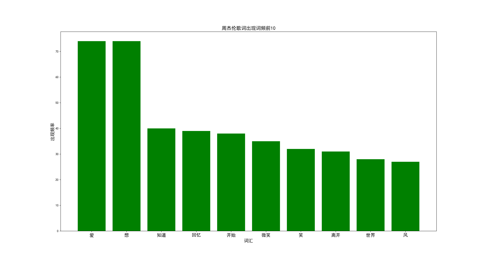

# 酷狗音乐周杰伦专辑歌曲歌词分析
## 项目内容
* 抓取酷狗音乐周杰伦专辑歌曲，获得周杰伦歌曲歌词。通过对歌词分词、使用词云制作周总歌词词云。
## 项目思路
1. 分析酷狗音乐网页页面，依次获取周杰伦专辑名、歌曲、最终获得歌词；
2. 使用 requests 请求数据，由于本次爬取量较小，使用 json 序列化保存获取的数据；
3. 使用 jieba 对周总歌词进行分词；matplotlib 对词频前 10 的词语用柱状图表示，对词频前 300 的词制作词云。
## 运行环境
* python3.7
* windows
* jupyter notebook

## 运行依赖包
* requests
* matplotlib
* jieba
* wordcloud
* json
## 文件说明
### 数据抓取文件：albumlist.json、lyriclist.json、zjl.text
* albumlist.json 从酷狗音乐获取的周杰伦专辑信息；
* lyriclist.josn 对专辑内歌曲分类后，获得的各歌曲歌词列表；
* zjl.text 将所有歌词汇总写入文本文件中。
* jieba2.txt 和 stop2.txt 使用结巴分词时需要的文件。jieba2.txt 内的词汇可以帮助结巴认识新的词汇，stop2.txt 中的词汇可以使结巴忽略一些词语。
### 代码文件
* zhoujl.ipynb 和 zhoujl.py zhoujl.py 是从 zhoujl.ipynb 中转的。所以这两个文件内容是一样的。

      # 结巴分词
      # 这是使用分词后的权重绘制词云，或者使用分词后的文本绘制,弹幕词云
      import jieba.analyse
      #显示图形，jupyter notebook 中使用
      %matplotlib inline 

      # 数据生成---------------------------
      jieba.load_userdict(r'C:\Users\yc\Desktop\jieba2.txt') # 导入结巴中没有的词语
      jieba.analyse.set_stop_words(r'C:\Users\yc\Desktop\stop2.txt')  # 导入让结巴忽略的词语
      with open(r'C:\Users\yc\Desktop\zhoujl\zjl.text', 'rb' ) as f: 
          sentence = f.read()
      a = jieba.analyse.extract_tags(sentence, topK=300, withWeight=True, allowPOS=()) # 分词，返回频率最高的前300个词语。
      print(a)
      print(len(a))

### 图片文件
* z.png 使用词云绘图传入的模板图；
* wordcloud.png 使用词云绘制的图片；
* rank.py 前10高频词柱状图。
## 图片效果展示
* 高频词柱状图
 
* 高频词词云
 
